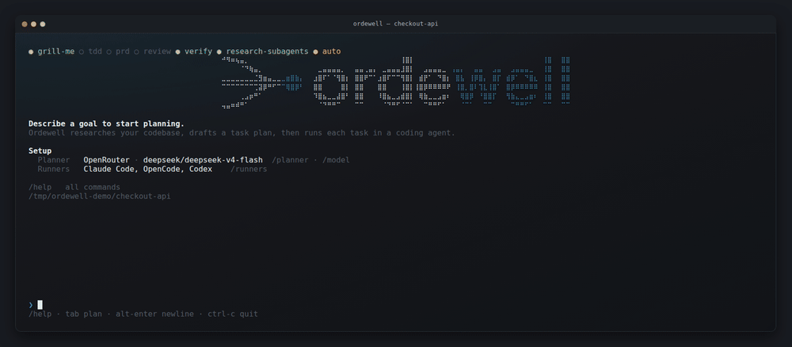
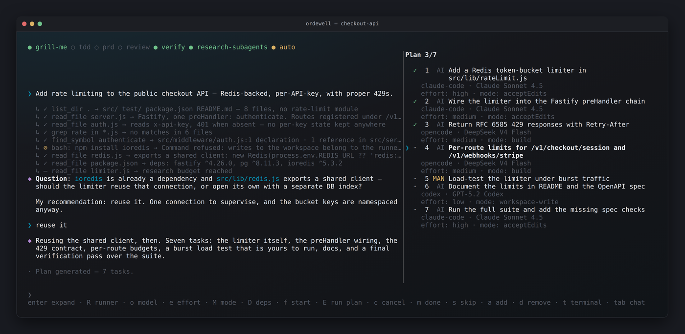
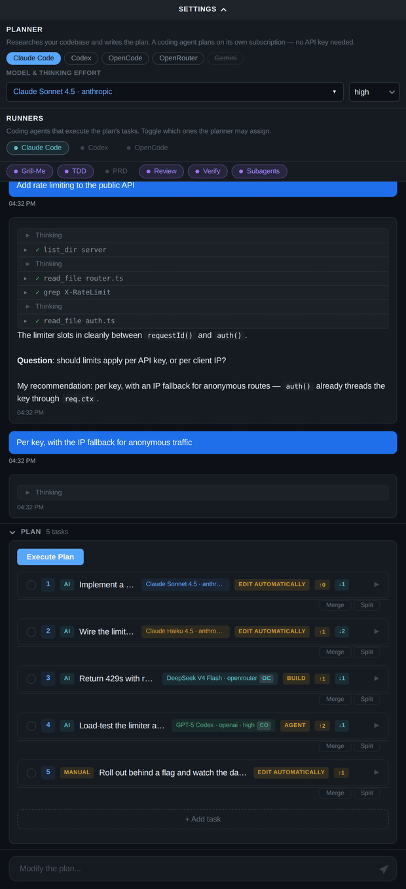

<p align="center">
  <picture>
    <source media="(prefers-color-scheme: dark)" srcset="assets/readme/logo-dark.png">
    
  </picture>
</p>

<p align="center">
  <strong>Turn one goal into an ordered plan of coding-agent tasks — each with its own runner, model and mode — then execute and verify it.</strong>
</p>

<p align="center">
  <a href="https://ordewell.ai"><strong>Website</strong></a> ·
  <a href="https://ordewell.ai/docs.html">Docs</a>
</p>

<p align="center">
  <a href="LICENSE"></a>
  <a href="https://www.npmjs.com/package/@ordewell/cli"></a>
  <a href="https://github.com/ordewell/ordewell/actions/workflows/ci.yml"></a>
  <a href="https://github.com/ordewell/ordewell/stargazers"></a>
</p>

<p align="center">
  
</p>

---

## What this is

- **A plan you can rewrite before a token is spent.** The plan is a typed artifact, not an agent's internal state: every task carries a runner, model, thinking effort and mode, and you can change any of them, add and remove tasks, and rewire dependencies — without losing completed work or round-tripping the AI.
- **The right model per task, chosen in the open.** The planner makes one portfolio decision across the whole plan — a security refactor and a README update do not deserve the same model — and shows you every assignment before anything runs ([why a separate planner?](docs/why-a-separate-planner.md)).
- **Verdicts from evidence, not opinion.** A task completes only when its unique completion marker appears in the runner's output; exit code is retained as diagnostic evidence. The model is never the tie-breaker. Stuck tasks can be advanced with *Mark complete*, and a task marked done by mistake goes back with *Mark not done*.
- **A planner that talks back.** Planning is one continuous chat: it researches your repo read-only, asks when your goal is vague, and its final message *is* the plan ([ADR-0002](docs/adr/0002-planner-as-conversation-loop.md)). Reads run in parallel; anything reaching outside the workspace asks once; commands that would write are refused outright ([ADR-0008](docs/adr/0008-planner-exploration-envelope.md)).
- **No extra API key required.** Claude Code, Codex, or OpenCode can *be* the planner, strictly read-only, on the subscription you already hold for the runners ([ADR-0009](docs/adr/0009-coding-agents-as-planners.md)).
- **Multi-runner by design.** Enable several and the planner assigns one per task. Claude Code, Codex and OpenCode ship built-in; anything else — Aider, your own CLI — is a plugin manifest, not a code change.

---

## Quick Start

Node.js ≥ 20 on macOS, Linux or Windows. The TUI also needs **tmux** — see
Platform support below.

```bash
npm install -g ordewell
ordewell                                       # the TUI — chat on the left, plan on the right
```

That's it. First run asks for a planner and a runner, set from inside
(`/planner`, `/runners`, `/key`) — no restart, no API key required up front.

`npx ordewell` works the same without a global install; the package also
ships scoped as `@ordewell/cli`.

For VS Code instead, install the extension — it carries its own core, so
there is nothing to install from npm:

```bash
code --install-extension ordewell.ordewell
```

Or search **Ordewell** in the Extensions view.

Building from source:
`git clone https://github.com/ordewell/ordewell.git && cd ordewell && npm install && npm run build && npm link -w packages/cli`
— see [CONTRIBUTING.md](CONTRIBUTING.md).

### Scriptable / headless

Every slash command is also a subcommand — set the planner and runner by env
var to skip the TUI entirely.

**Already run Claude Code, Codex, or OpenCode?** No separate API key — it
runs on the subscription you already hold:

```bash
export AI_PROVIDER="claude-code"        # or codex, opencode
ordewell plan --goal "Add rate limiting to the public API" && ordewell run
```

Mutation always stays with the runners; the planner agent only explores and
reasons. Same toggles apply from a UI: `/planner`, `/model`,
`/planner-effort`, or the planner bar in VS Code.

**Prefer an API key?** Twenty-five providers are recognised via their own
`*_API_KEY` — OpenRouter, Anthropic, OpenAI, Gemini, xAI, Groq, DeepSeek,
Mistral, Together, Fireworks, Perplexity, Cerebras, DeepInfra, Cohere,
Novita, Kimi, Zhipu, Qwen, Doubao, Hunyuan, Baichuan, MiniMax, Yi, StepFun
and SiliconFlow. Run `ordewell key` for variable names, or point
`OPENAI_COMPATIBLE_BASE_URL` at anything else, including a local model
server.

```bash
export OPENROUTER_API_KEY="sk-or-..."
ordewell plan --goal "Add rate limiting to the public API" && ordewell run
```

---

## Three surfaces, one core

### VS Code

A streaming timeline: live thinking, each research step with its outcome, and task cards you expand for the runner's own output. Retarget a task's runner and its model and mode re-derive in place. The whole loop is below, under **The VS Code loop, end to end**.

### Terminal UI



Everything the extension does, over SSH. `tab` swaps chat and plan pane; single keys drive the plan (`f` start, `E` run all, `m` toggle done, `R` runner, `o` model). `/help` lists the rest.

### CLI

```console
$ ordewell plan --goal "Add rate limiting to the public API"

Generating plan for: "Add rate limiting to the public API"...
✓ list_dir src → D middleware F router.ts F auth.ts
✓ grep X-RateLimit → no matches in 6 files

Question: should limits apply per API key, or per client IP?
My recommendation: per key — auth() already threads the key through req.ctx.
> per key, with an IP fallback for anonymous routes

Plan: 4 tasks (3 AI, 1 Manual) — claude-code, opencode
Session: session-1751600000000

   1. [ AI] Add a token-bucket limiter in src/middleware/rateLimit.ts (Claude Sonnet 4.5 · Claude Code)
   2. [ AI] Wire the limiter into route registration (Claude Haiku 4.5 · Claude Code)
   3. [ AI] Return RFC 6585 429s with Retry-After (DeepSeek V4 Flash · Opencode)
   4. [MAN] Document the limit headers in the OpenAPI spec

  [MAN] = manual step — run `ordewell tui` to work through it

  Run 'ordewell run' to execute, 'ordewell status' to inspect, or 'ordewell tui' for the full UI.

$ ordewell run
Executing plan...
  ✓ #a1b2 completed — PASS: Verified: completion marker detected in agent output. Task c
  ⟳ #c3d4 in_progress
[2/Wire the limiter into route registration] Started: claude-code / claude-haiku-4-5

Done. 4 completed, 0 failed, 0 blocked.
```

Every slash command is also an `ordewell` subcommand, so nothing is UI-only and headless automation reaches everything a human can.

---

## How it works

1. **Describe a goal** in plain prose.
2. **The planner researches** your workspace read-only and interleaves questions with research in one persistent conversation ([ADR-0008](docs/adr/0008-planner-exploration-envelope.md)).
3. **A plan appears** — ordered tasks, each with a runner, model, thinking effort and mode. Edit anything inline, or reprompt to reshape the whole plan without losing completed work.
4. **Execution** spawns a real coding-agent session per AI task, respecting the dependency graph and handing each task its predecessors' results. Manual tasks become checklists.
5. **The VerdictEngine** completes a task only once its marker appears; an exit without one fails visibly. Sessions auto-save to `.ordewell/sessions/`.

---

<details>
<summary><strong>Usage examples</strong> — planning, editing, multi-runner, plugins</summary>

**Plan, edit, execute**

```bash
# The planner researches the repo and converses if the goal is underspecified
ordewell plan --goal "Migrate the config loader from JSON to TOML"

# Reassign before running — runner first, since it re-derives model, effort and mode
ordewell task-runner 2 opencode
ordewell task-deps 3 1,2

# Execute; independent tasks run in parallel (default: 3 concurrent sessions)
ordewell run

# Inspect any session later
ordewell status --session-id session-1751600000000
```

The surfaces differ only in how you name a target: the TUI opens a picker, the CLI takes an argument — and omitting the argument prints the same options the picker would have shown.

```bash
ordewell task-model 3            # lists the models that task's runner can spawn
ordewell task-model 3 sonnet     # picks one
```

**Configure without an editor**

```bash
ordewell planner claude-code     # plan on a coding agent's subscription — no API key
ordewell model set sonnet        # scoped to that agent's own catalog
ordewell planner-effort high     # a variant of the selected model
ordewell key set openrouter sk-… # stored in .env, never echoed back
ordewell runners codex off
```

Each pushes to the running server *before* writing `.env`, so the change lands on the next plan with no restart — and a refused connection cannot leave the file holding a setting the daemon never saw.

**Deep-interview planning with a PRD**

```bash
ordewell grill-me on   # planner interrogates your goal before outlining (min. 3 probing questions)
ordewell prd on        # planner previews, then writes a full PRD to .scratch/<slug>/PRD.md
ordewell tdd on        # tasks are augmented with red-green-refactor instructions

ordewell plan --goal "Real-time collaborative editing"
# → the planner grills you in chat, drafts the PRD, waits for your OK,
#   then commits the plan as its final message
```

**Multi-runner plans and custom runners**

```bash
# Pass --runner repeatedly to build a runner set; the planner assigns one per task
ordewell plan --goal "Refactor auth module" --runner claude-code --runner opencode

# Bring your own CLI agent via a plugin manifest
ordewell plugins create my-runner        # scaffolds manifest.json
ordewell plugins install github:user/repo
ordewell plugins list
```

**The other two front ends**

```bash
ordewell               # full-screen terminal UI — same as `ordewell tui`
ordewell web --daemon  # the local API server, in the background
```

`ordewell web` starts the HTTP + WebSocket API on `127.0.0.1:3742` that the CLI and TUI are clients of — every other command starts it for you on demand. It serves JSON, not a web page; there is no browser dashboard yet.

For VS Code, install the extension and open the Ordewell panel — see Quick Start.

| Area | Commands |
| --- | --- |
| Planning | type a goal, `/approve`, `/run`, `/stop` |
| Tasks | `/add-task`, `/remove-task`, `/complete`, `/uncomplete`, `/skip`, `/retry`, `/cancel`, `/force-start` |
| Skills | `/grill-me`, `/tdd`, `/prd`, `/review`, `/verify`, `/research-subagents` |
| Models | `/model`, `/key`, `/allowlist`, `/runners`, `/auto`, `/refresh` |
| Sessions | `/sessions`, `/new`, `/save`, `/load`, `/delete` — a loaded session is adopted by the server, so its plan stays executable |
| System | `/help`, `/mouse`, `/quit` |

API keys typed into `/key` are masked on screen and written to your `.env`.

Text is selectable and copyable with the mouse, as in any other program: Ordewell
does not capture the terminal's mouse. Scroll with `pgup`/`pgdn`. If you would
rather have wheel scrolling and can live without drag-to-select, `/mouse on`
swaps the trade (and remembers it via `ORDEWELL_TUI_MOUSE` in your `.env`).

A task's own terminal is a tmux window, where tmux does hold the mouse so the
wheel scrolls its scrollback. Selecting there still copies to your system
clipboard: drag to select and release to copy, or double/triple-click for a word
or a line. Install `wl-copy`, `xclip` or `xsel` on Linux if you have none of them
— without one, copying falls back to an OSC 52 escape that some terminals ignore.

</details>

<details>
<summary><strong>The VS Code loop, end to end</strong> — research, question, plan, execution, verdict</summary>



</details>

<details>
<summary><strong>Platform support</strong> — including the Windows notes</summary>

| Surface | Linux | macOS | Windows |
|---------|-------|-------|---------|
| VS Code extension | ✅ | ✅ | ✅ |
| API server | ✅ | ✅ | ✅ |
| CLI | ✅ | ✅ | ✅ |
| TUI | ✅ needs tmux | ✅ needs tmux | needs tmux — run it under WSL |

**The TUI requires tmux on every platform**, not only Windows — it is what backs
each task's live terminal. Install it from your package manager (`apt install
tmux`, `brew install tmux`) before running `ordewell`. Everything else runs
natively on Windows: the planner (including harness planners), task execution,
model discovery, and the read-only exploration envelope all work there.

Two notes for Windows. Install the agent CLIs with their **native installers** where one exists — an npm-installed `claude`/`codex`/`opencode` is a `.cmd` shim, which has to start through cmd.exe and inherits its 8191-character command-line limit; that is fine for task prompts but not for the harness planner's larger system prompt, and Ordewell will tell you so by name rather than silently truncating it. And keep **Git for Windows** installed: its POSIX shell is what the planner runs research commands in, so `ls`, `cat`, `grep` and friends behave the same as they do everywhere else. See [ADR-0010](docs/adr/0010-windows-support.md).

Any install route is found, on PATH or not: the PowerShell one-liner installers (`irm https://claude.ai/install.ps1 | iex`, OpenCode's equivalent), npm, pnpm, Yarn, bun, Scoop, Chocolatey, WinGet, and Volta. If a runner is greyed out in the picker right after you installed it, restart the VS Code window — a GUI-launched extension host holds the PATH it started with.

</details>

<details>
<summary><strong>Configuration</strong> — the four settings that matter</summary>

| Option | Default | What it does |
| --- | --- | --- |
| One provider key (`OPENROUTER_API_KEY`, `ANTHROPIC_API_KEY`, `GEMINI_API_KEY`, …) | — | The one required setting. Twenty-five providers are recognised, each from its own variable — `ordewell key` lists them — plus any OpenAI-compatible endpoint via `OPENAI_COMPATIBLE_BASE_URL`. The provider is auto-detected from whichever key is set (force with `AI_PROVIDER`). Not needed when `AI_PROVIDER` is `claude-code`, `codex`, or `opencode` — those plan with the CLI's own subscription. |
| `ORCHESTRATOR_MODEL` | `deepseek/deepseek-v4-flash` | The planner model — a budget model by default; it plans and researches but never writes code. Change via `ordewell model set <id>` or `/model`, which scope the choice to the planner backend's own catalog. With a coding-agent planner, it must be one of that agent's own model ids. |
| `ORDEWELL_PLANNER_EFFORT` | — | Thinking effort for a coding-agent planner, from the selected model's own variants (`low`, `high`, `adaptive`, …). Ignored by vendor planners, whose effort is baked into the model id. Change via `ordewell planner-effort <level>` or `/planner-effort`. |
| `ORDEWELL_MAX_PARALLEL` | `3` | Max concurrent AI task sessions (1–5). Independent tasks run in parallel; the dependency graph is always respected. |

Run `ordewell --help` for the full list of environment variables, or `ordewell setup` for the interactive wizard. VS Code users: everything is mirrored under `ordewell.*` settings.

</details>

<details>
<summary><strong>Architecture</strong></summary>

```text
packages/
├── core/    Pure TypeScript, zero UI deps — Session, PlanStore, Planner,
│            TaskOrchestrator, VerdictEngine, ModelResolver, ModeResolver,
│            RunnerRegistry + manifest template engine
├── cli/     ordewell: tui, plan, run, status, stop, web, models, setup,
│            plugins, grill-me, prd, tdd — plus tui/, a pure state +
│            renderer core behind a thin raw-mode terminal driver
├── vscode/  Extension + webview: streaming planner timeline, task cards,
│            TTY capture via script(1)
└── web/     Hono HTTP + WebSocket server — the local daemon the CLI and
             TUI drive over 127.0.0.1 (session pool, headless execution)
```

The TUI's core is pure — a reducer returning `{ state, effects }` and a renderer returning one string per terminal row ([ADR-0006](docs/adr/0006-tui-pure-core-thin-driver.md)).

Tasks default to each runner's autonomous mode (toggle with `/auto`), and the plan is the source of truth for what runs — modes are never silently rewritten at spawn ([ADR-0001](docs/adr/0001-autonomous-mode-resolution.md)).

Every surface consumes one event union (`SessionMessage`) over one broadcast seam — the domain vocabulary lives in [CONTEXT.md](CONTEXT.md) and design decisions in [docs/adr/](docs/adr/).

</details>

<details>
<summary><strong>Acknowledgements</strong></summary>

The deep-interview planning workflows — `grill-me`, PRD drafting, TDD task augmentation, and review mode — are adapted from [Matt Pocock's skills](https://github.com/mattpocock/skills) (MIT), rebuilt as prompt blocks inside Ordewell's planner and runner prompts. If you want those workflows in a plain coding-agent session rather than an orchestrated plan, his repo is the place to start.

</details>

---

## Contributing

Bug reports, feature requests and pull requests are welcome — start with [CONTRIBUTING.md](CONTRIBUTING.md) for the build order and the layout of the tree. Security issues go to [SECURITY.md](SECURITY.md), not the public tracker.

New to the codebase? [CONTEXT.md](CONTEXT.md) is the domain glossary and [docs/adr/](docs/adr/) records why things are the way they are.

## License

Licensed under the [Apache License 2.0](LICENSE). The Ordewell name and logos are not covered by that licence — see [NOTICE](NOTICE).
