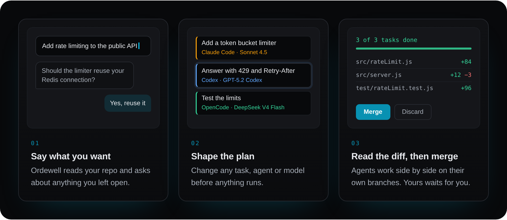

<p align="center">
  <picture>
    <source media="(prefers-color-scheme: dark)" srcset="assets/readme/logo-dark.png">
    
  </picture>
</p>

<p align="center">
  <strong>Task orchestration for coding agents.</strong><br>
  Turn a goal into an editable plan. Run it with your coding agents. Review and merge.
</p>

<p align="center">
  <a href="https://ordewell.ai"><strong>Website</strong></a> ·
  <a href="https://ordewell.ai/docs">Documentation</a> ·
  <a href="https://ordewell.ai/news">News</a>
</p>

<p align="center">
  <a href="LICENSE"></a>
  <a href="https://www.npmjs.com/package/@ordewell/cli"></a>
  <a href="https://github.com/ordewell/ordewell/actions/workflows/ci.yml"></a>
  <a href="https://github.com/ordewell/ordewell/stargazers"></a>
</p>

<p align="center">
  
</p>

Describe what you want to build. Ordewell explores your repository, asks clarifying
questions, and turns your goal into a plan you can read and edit. When you're ready,
run it: independent tasks work in parallel, each on its own branch. Review the
combined diff and choose when to merge it into your branch.

Claude Code, Codex and OpenCode are supported out of the box, and can be mixed
freely within one plan.

## Features

- **An editable plan.** Change any task's prompt, runner, model, effort or mode, add
  or remove tasks, and rewire dependencies without another round trip to the model.
- **The right model for each task.** A security refactor and a README update get
  different models, and you see every assignment before a token is spent.
- **Isolated execution.** Every task that changes code works on its own branch.
  Passing work lands on one integration branch in plan order, and you choose when
  to merge it.
- **Skills your team shares.** Write down how your team works once, as a skill in
  your repository. The planner attaches it to the tasks it fits, whichever agent
  runs them.
- **Operations in the right place and order.** A deploy, a cloud CLI call or a
  push runs as an ops task in your own checkout, and waits until the change it
  depends on is merged into your branch.
- **Done means reported.** A task finishes when its agent reports it done through
  Ordewell's own tools, never because a model thinks the work looks finished. You
  see which tasks passed, failed or need you, and can read each one's log live.
- **A planner that cannot write.** It reads, asks, and plans. Commands that would
  change your repository are refused.
- **No extra API key.** A coding agent you already pay for can be the planner. An API
  key from any of 25 providers works too.
- **Use it where you work.** A terminal UI, a VS Code extension, a CLI for scripts
  and a local API, all sharing one core.

## Installation

```bash
npm install -g ordewell
```

For VS Code, install [Ordewell from the Marketplace](https://marketplace.visualstudio.com/items?itemName=ordewell.ordewell)
or run `code --install-extension ordewell.ordewell`. In Cursor, Windsurf or VSCodium,
get it from [Open VSX](https://open-vsx.org/extension/ordewell/ordewell). The
extension bundles its own core and needs nothing from npm.

**Requirements:** Node.js 20 or newer, at least one of Claude Code, Codex or
OpenCode, and git for task isolation. On Windows, run the terminal UI under WSL.

## Quick start

Run `ordewell` in your project to open the terminal UI, then type a goal. The first
run lets you pick a planner and runners with `/planner` and `/runners`.

The same workflow is available from the command line:

```bash
export AI_PROVIDER=claude-code      # plan with Claude Code, Codex or OpenCode

ordewell plan --goal "Add rate limiting to the public API"
ordewell run
ordewell handoff review             # read the diff
ordewell handoff merge              # bring it onto your branch
```

Between `plan` and `run`, the plan is yours to edit:

```bash
ordewell task-runner 2 opencode     # move a task to another agent
ordewell task-model 3 sonnet        # or just change its model
ordewell task-deps 3 1,2            # make it wait for tasks 1 and 2
```

## See it in action

<p align="center">
  
  <br>
  <sub>A real run, sped up where marked. <a href="https://ordewell.ai/assets/demo.mp4">Watch the full 48 seconds</a>.</sub>
</p>

## How it works

1. **Describe your goal.** The planner explores your workspace without modifying
   it and asks clarifying questions.
2. **Review the plan.** Read the tasks and their dependencies. Edit prompts, agent
   assignments and models before running.
3. **Run the tasks.** Each task starts a fresh coding agent session. Independent
   tasks run in parallel; dependent tasks wait for the work they need. Code changes
   stay on separate branches, and you can follow each task's progress.
4. **Review and merge.** Ordewell combines the changes for your review. Read the
   diff, then merge it into your branch or discard the run. If a task or a merge
   needs your attention, Ordewell shows you where.

Folders containing several repositories are handled as one workspace: each task
gets a worktree of every repository and lands in all of them or none. See
[isolation and handoff](https://ordewell.ai/docs#isolation) for details.

## Documentation

The [documentation](https://ordewell.ai/docs) covers the planner options, skills,
commands, configuration and platform notes. Design decisions, including the options
that were rejected, are recorded as [architecture decision records](docs/adr/), and
[CONTEXT.md](CONTEXT.md) defines the project's vocabulary. To write your own
planner or task skills, see the [skills guide](docs/skills.md).

## Where it's going

- **Now:** take-over, opening a running task in its coding agent's own terminal UI ([#58](https://github.com/ordewell/ordewell/issues/58)).
- **Next:** the planner keeps watching a run after you approve it, and suggests fixes when a task fails or gets stuck.
- **Later:** the planner supervises a run on its own, within limits you set in advance.

The full roadmap, and where to help, is in [#21](https://github.com/ordewell/ordewell/issues/21).

## Contributing

Contributions are welcome. Please read [CONTRIBUTING.md](CONTRIBUTING.md) for the
build order and project layout, and report security issues through
[SECURITY.md](SECURITY.md) rather than the public tracker.

## Acknowledgements

The grilling, spec, architecture and TDD skills are
adapted from [Matt Pocock's skills](https://github.com/mattpocock/skills) (MIT).

## License

Ordewell is licensed under the [Apache License 2.0](LICENSE). The Ordewell name and
logos are not covered by this license; see [NOTICE](NOTICE).
