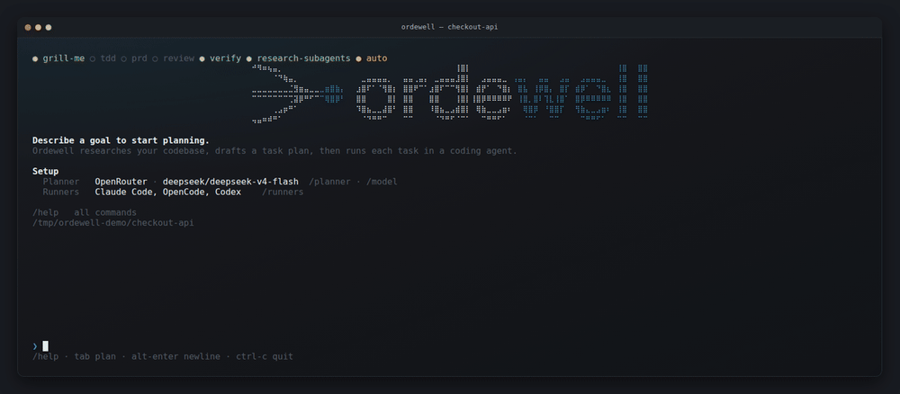

<p align="center">
  <picture>
    <source media="(prefers-color-scheme: dark)" srcset="assets/readme/logo-dark.png">
    
  </picture>
</p>

<p align="center">
  <strong>Task orchestration for coding agents.</strong><br>
  One goal becomes an ordered plan of tasks, each on its own runner, model and branch.
</p>

<p align="center">
  <a href="https://ordewell.ai"><strong>Website</strong></a> ·
  <a href="https://ordewell.ai/docs">Documentation</a> ·
  <a href="https://ordewell.ai/news">News</a>
</p>

<p align="center">
  <a href="LICENSE"></a>
  <a href="https://www.npmjs.com/package/@ordewell/cli"></a>
  <a href="https://github.com/ordewell/ordewell/actions/workflows/ci.yml"></a>
  <a href="https://github.com/ordewell/ordewell/stargazers"></a>
</p>

<p align="center">
  
  <br>
  <sub>A real run, sped up where marked. <a href="https://ordewell.ai/assets/demo.mp4">Watch the full 48 seconds</a>.</sub>
</p>

Ordewell turns a goal into a plan you can read and change before anything runs. A
planner researches your repository and asks about whatever you left vague. It then
hands back a dependency graph of tasks, and each task names the coding agent, model
and thinking effort it will use. Independent tasks run in parallel, each in its own
git worktree. A task only counts as done when the agent reports it done — through
Ordewell's own tool on the structured transport, or its completion marker in the
output as the fallback — and nothing reaches your branch until you have reviewed
the result.

Claude Code, Codex and OpenCode are supported out of the box, and can be mixed
freely within one plan.

## Features

- **An editable plan.** Change any task's prompt, runner, model, effort or mode, add
  or remove tasks, and rewire dependencies without another round trip to the model.
- **The right model for each task.** A security refactor and a README update get
  different models, and you see every assignment before a token is spent.
- **Isolated execution.** Every task that changes code works on its own branch.
  Passing work lands on one integration branch in plan order, and you choose when
  to merge it.
- **Operations in the right place and order.** A deploy, a cloud CLI call or a
  push runs as an ops task in your own checkout, and waits until the change it
  depends on is merged into your branch.
- **Verdicts from evidence.** Completion is decided by the runner's own done
  signal — a tool call on the structured transport, or its completion marker as
  the fallback — never by a model's opinion of its own work.
- **A planner that cannot write.** It reads, asks, and plans. Commands that would
  change your repository are refused.
- **No extra API key.** A coding agent you already pay for can be the planner. An API
  key from any of 25 providers works too.
- **Use it where you work.** A terminal UI, a VS Code extension, a CLI for scripts
  and a local API, all sharing one core.

## Installation

```bash
npm install -g ordewell
```

For VS Code, install [Ordewell from the Marketplace](https://marketplace.visualstudio.com/items?itemName=ordewell.ordewell)
or run `code --install-extension ordewell.ordewell`. The extension bundles its own
core and needs nothing from npm.

**Requirements:** Node.js 20 or newer, at least one of Claude Code, Codex or
OpenCode, and git for task isolation. tmux is optional: only tasks on a
runner with no structured connector use it, to give each a terminal window you
can open. On Windows, run the terminal UI under WSL.

## Quick start

Run `ordewell` in your project to open the terminal UI, then type a goal. The first
run lets you pick a planner and runners with `/planner` and `/runners`.

The same workflow is available from the command line:

```bash
export AI_PROVIDER=claude-code      # plan with Claude Code, Codex or OpenCode

ordewell plan --goal "Add rate limiting to the public API"
ordewell run
ordewell handoff review             # read the diff
ordewell handoff merge              # bring it onto your branch
```

Between `plan` and `run`, the plan is yours to edit:

```bash
ordewell task-runner 2 opencode     # move a task to another agent
ordewell task-model 3 sonnet        # or just change its model
ordewell task-deps 3 1,2            # make it wait for tasks 1 and 2
```

## How it works

1. **Plan.** The planner explores your workspace without modifying it, asks
   clarifying questions, and produces an ordered list of tasks with dependencies.
2. **Execute.** Each task starts a fresh coding agent session — in its own
   worktree, or in your checkout for an ops task — given the results of the tasks
   it depends on. Independent tasks run concurrently,
   three at a time by default.
3. **Verify.** A task passes when the agent reports it done — through Ordewell's
   own tool on the structured transport, or its unique completion marker in the
   output as the fallback. The exit code is kept as supporting evidence.
4. **Land.** A passing task is merged into the run's integration branch. If the
   merge conflicts, the task gets a chance to resolve it; if that fails, it waits for
   you with the conflicting files named.
5. **Hand off.** When the run finishes, review the diff, then merge it, discard it,
   or clean up its worktrees.

<p align="center">
  
</p>

Folders containing several repositories are handled as one workspace: each task
gets a worktree of every repository and lands in all of them or none. See
[isolation and handoff](https://ordewell.ai/docs#isolation) for details.

## Documentation

The [documentation](https://ordewell.ai/docs) covers the planner options, skills,
commands, configuration and platform notes. Design decisions, including the options
that were rejected, are recorded as [architecture decision records](docs/adr/), and
[CONTEXT.md](CONTEXT.md) defines the project's vocabulary. To write your own
planner or task skills, see the [skills guide](docs/skills.md).

## Where it's going

- **Now:** take-over, opening a structured task in its runner's own terminal UI ([#58](https://github.com/ordewell/ordewell/issues/58)). The structured transport is the default and tmux is optional ([#61](https://github.com/ordewell/ordewell/issues/61)).
- **Next:** the planner keeps watching a run after you approve it, and suggests fixes when a task fails or gets stuck.
- **Later:** the planner supervises a run on its own, within limits you set in advance.

The full roadmap, and where to help, is in [#21](https://github.com/ordewell/ordewell/issues/21).

## Contributing

Contributions are welcome. Please read [CONTRIBUTING.md](CONTRIBUTING.md) for the
build order and project layout, and report security issues through
[SECURITY.md](SECURITY.md) rather than the public tracker.

## Acknowledgements

The grilling, spec, architecture and TDD skills are
adapted from [Matt Pocock's skills](https://github.com/mattpocock/skills) (MIT).

## License

Ordewell is licensed under the [Apache License 2.0](LICENSE). The Ordewell name and
logos are not covered by this license; see [NOTICE](NOTICE).
